# Dylan Web Design & Development Sprint 0

Welkom bij de README van mijn website voor Sprint 0 van de minor Web Design & Development.

## Week 1

### Maandag 2 februari
Jarig & vrij

### Dinsdag 3 februari
Vandaag heb ik een eerste idee voor de website gehad; ik wil een interactieve platformer maken waarbij je met het toetsenbord een personage kan besturen en vervolgens mijn leerdoelen kan vinden door rond te zoeken in het scherm
Voor nu heb ik wat standaard HTML en CSS erin gezet en heb ik ervoor gezorgd dat de website hier op Github staat. Momenteel wordt deze geupdatet wanneer ik de bestanden handmatig upload.
Verder heb ik een knop rechtsboven staan die de kleuren van de achtergrond kleur veranderd. Dit wordt gedaan door de body een .night class te geven.

### Woensdag 4 februari
Vandaag was ik helaas te laat vanwege het OV. De treinen op Schiphol reden niet vanwege een brandalarm. Ik kon gelukkig nog wel de Directus → FETCH → JSON → HTML workshop volgen. Ik heb geleerd over API's en JSONs en heb mijn Github website nu gekloond op mijn computer. Nu kan ik mijn veranderingen gelijk pushen naar Github. 

Verder heb ik een visitekaart website gemaakt tijdens de workshop waarmee ik data heb opgehaald uit een API over mezelf door een URL op te halen, de data eruit te fetchen met een functie en deze af te spelen met InnerHTML.

Op mijn eigen website ben ik begonnen aan een platformer. Ik heb al ervaring met het maken van platformers in JavaScript in jaar 1, dus vond het wel bij mij passen. Momenteel heb ik een canvas met een vierkant die je links en rechts kan besturen met de W en D. Verder kun je ook de pijltoetsen gebruiken en staan er op het scherm ook pijltjes die je kan gebruiken. Verder is er zwaartekracht waardoor het vierkantje omlaag valt en heb ik een platform waar het vierkantje op kan staan. In jaar 1 had ik een volledig spel gemaakt in JavaScript. Hier heb ik wat code uit recycled. Ik heb veel code wel herschreven want mijn code van toen was niet heel optimaal en netjes geschreven. Verder had ik toen een tutorial gebruikt van Chris Courses voor JavaScript platformers. Die video staat vermeld in de bronnenlijst.

### Donderdag 5 februari
Vandaag zijn we begonnen met 2 workshops: 1 over thema's en 1 over responsiveness. Voor themas is laten zien hoe je makkelijk de kleuren kan bepalen van light & dark mode. Ik ga zelf wat anders doen dan light/dark. Ik heb het idee om een water thema toe te voegen. In mijn platformer zou je dan op de normale thema van links naar rechts kunnen bewegen met zwaartekracht. Je kan niet in de lucht springen. Als het water thema aan staat, kun je in de lucht "zwemmen". Voor nu heb ik mijn code aangepast om een water thema aan en uit te zetten. Verder heb ik mijn ::root veranderd naar html.

Op het begin van de dag werd iedereens Github pagina besproken. Mijn Github was bijna goed. Het enige wat ik miste is wat folders. Ik heb mijn stylesheet en script in hun eigen mapje gezet en een IMG folder toegevoegd. 

Ik heb de spring functie toegevoegd. Je kan springen met W, Space en de bovenpijl toets (zowel op scherm als toetsenbord). Verder heb ik de toetsenbord op het scherm geupdatet om te werken op mobiel.

### Vrijdag 6 februari
Vandaag moesten we een eerste versie van onze website laten zien. Ik heb in de ochtend een level gemaakt voor op mobiel. Dit level heb ik eerst ontworpen in Figma en daarna toegepast in JavaScript. Ik kon in Figma mijn frame dezelfde grootte maken als mijn canvas en kon daardoor alle waardes van grootte en coordinaten 1 op 1 toepassen.

Verder heb ik mijn code wat opgeschoont. Er zat een bug in het spel waardoor je in het water thema extra hoog sprong. Ik weet niet precies waardoor het kwam maar toen ik wat overbodige code (over wel/niet kunnen springen op platforms) had verwijderd was de sprong weer normaal. Verder kun je niet meer buiten het canvas springen (tenzij je naar beneden valt)

Ook heb ik een boek object toegevoegd. Voor nu nog een vierkant. Ik heb een collider functie gemaakt met behulp van ChatGPT waardoor de speler met dit object kan interacteren. Wanneer de speler tegen het "boek" aanloopt verdwijnt het boek en verschint een popup met mijn leerdoelen
Leerdoel 1 - Ik wil indrukwekkende animaties kunnen maken in CSS
Leerdoel 2 - Ik wil mezelf verbeteren in ideeen bedenken voor themas van websites
Leerdoel 3 - Ik wil meer efficient code kunnen schrijven en zo min mogelijk overbodige code hebben.

### Samenvatting Week 1
In de eerste week heb ik mijn idee bedacht over wat mijn website zal worden en ik heb gekozen voor een interactieve platformer waarin je rond kan lopen om meer te ontdekken over mij. Ik vond platformers wel bij mij passen, want ik heb altijd al een passie gehad voor games en ik heb meerdere keren deze opleiding een platformer gemaakt dus dit leek mij een goed beeld van wie ik ben.

In de eerste paar dagen heb ik vooral gefocust op de standaard elementen van een platformer implementeren zoals lopen, springen, zwaartekracht etc. Ik heb eerder in de opleiding voor het vak Inleiding Programmeren een Mario platformer gemaakt dus ik ben terug gegaan in mijn code van toen. Ik had toen voor mijn basis een tutorial gebruikt van Chris Courses, link staat in de bronnenlijst. Ik zag dat er in mijn oude code heel vaak overbodige code zat en niet geoptimaliseerd was, mijn doel is om daar wel verandering in te brengen en om goede leesbare code te schrijven. Verder had ik toen voor alle assets PNGs gebruikt. Ik wil nu ook beter worden in de website mooi maken met hulp van CSS en JS effecten.

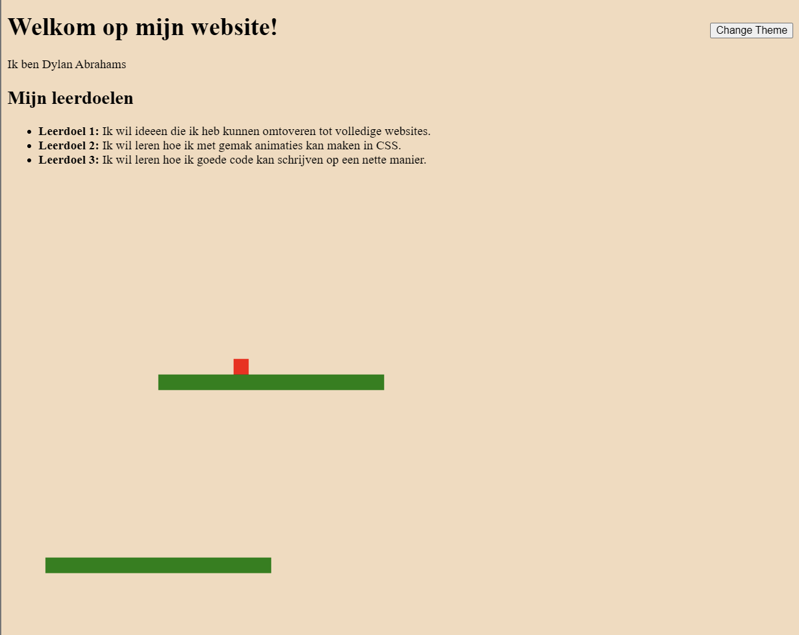

Verder heb ik deze week mijn website op Github geplaatst en deze in orde gemaakt met een README, folders, een werkende link naar de webpagina en een manier om makkelijk mijn inhoud te pushen via Github Desktop. Ik had eerst VS Codium gebruikt voor mijn code omdat het was aangeraden, maar uiteindelijk ben ik VS Code gaan gebruiken omdat Github Desktop zover ik weet alleen werkt met VS Code.

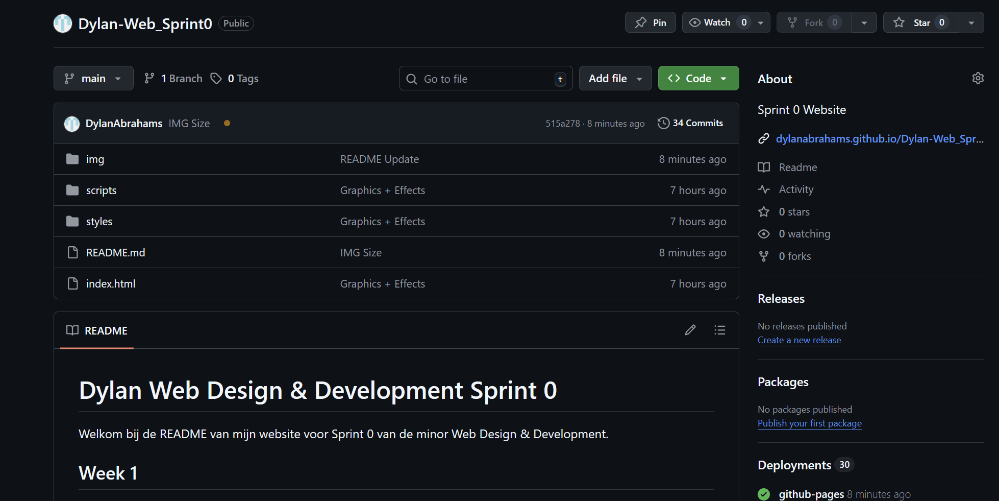

Voor mijn thema had ik eerst het idee om gewoon een light & dark theme te doen. Op de light theme zou het level overdag plaatsnemen met een zon en 's nachts zou de zon vervangen worden door een maan en zouden alle objecten donker van kleur zijn etc. Ik heb uiteindelijk toch besloten om het thema iets te maken wat effect heeft op de gameplay. Ik ben gekomen op een water thema waarmee de speler oneindig kan "zwemmen" zodat hij/zij op plekken kan komen die anders onbereikbaar zouden zijn. Er is rechtsboven een knop waarmee je het thema kan veranderen.

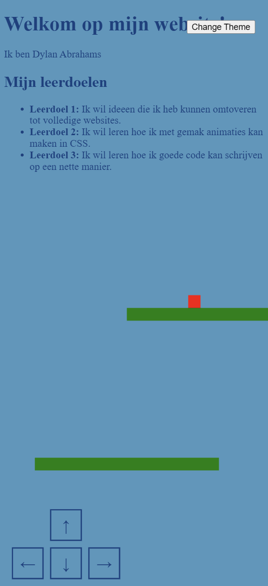

Voor de expo van vrijdag heb ik een level gemaakt waar de speler 3 leerdoelen kan aantikken en deze een popup zouden geven met het leerdoel. Ik had het level eerst in Figma gemaakt op formaat van de canvas. Vervolgens kon ik alle waardes van alle platforms overnemen (hun lengte, breedte, de X- en de Y-coordinaten) en deze toepassen in mijn script. Uiteindelijk ben ik tot dit prototype gekomen. Deze is gemaakt voor mobiel. Wellicht maak ik nog een desktop versie maar we hebben volgende week maar 3 dagen dus we zullen nog zien.

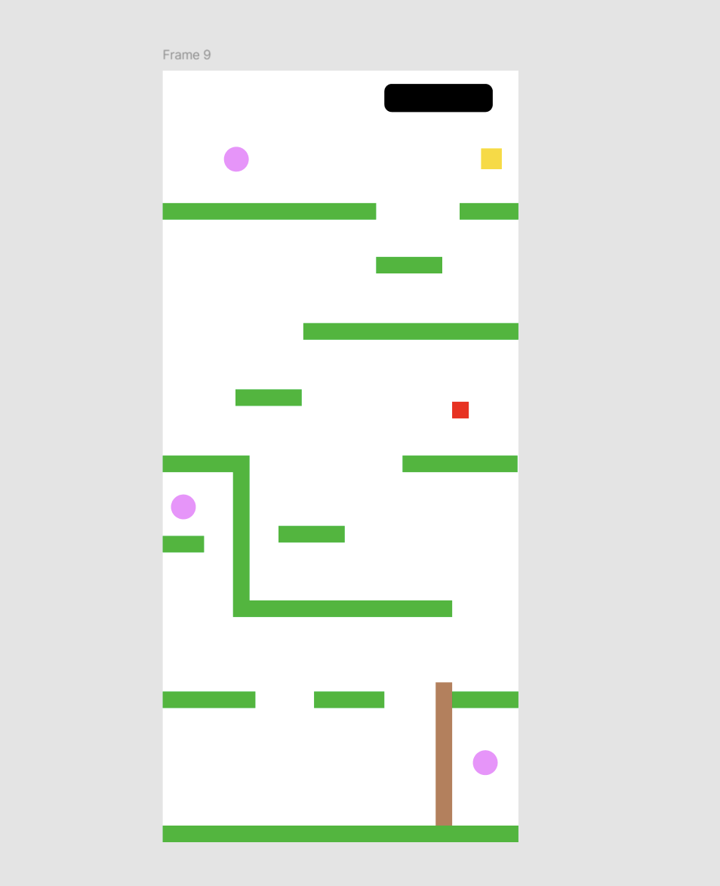

(Negeer de speler en tekst linksboven, dat is van week 2)

## Week 2

### Maandag 9 februari
Vandaag moet ik naar de tandarts om 13:00 dus ben ik helaas niet aanwezig. Verder deed het internet thuis vervelend dus had ik niet veel kunnen doen tot later in de middag.

Ik heb me vandaag veel bezig gehouden met het water thema. Ik heb mijn code iets anders opgezet. Eerst had ik 1 variabel voor de achtergrond kleur. Deze zou veranderen afhankelijk van het data thema. Nu heb ik gewoon 2 variabelen, 1 voor normale achtergrond, een voor water. De rede hiervoor is omdat ik een transitie heb toegevoegd in JavaScript waarbij het water van onder omhoog komt binnen een paar seconden. Omdat beide achtergrond kleuren in beeld moeten zijn heb ik het zo moeten doen. 

Ook heb ik een bubbel animatie toegevoegd. Ik had dit eerst met CSS gedaan maar helaas heb ik het uiteindelijk met JavaScript moeten doen zodat het zou werken met de thema transitie. Ik heb hier veel ChatGPT voor gebruikt door de hele tijd mijn eigen code op te sturen, zeggen wat ik wel en niet goed vind om uiteindelijk op een resultaat te komen waar ik tevreden mee ben.

Daarnaast heb ik het canvas een vaste grootte gemaakt. Ik heb het een formaat voor mobiel gemaakt, maar zal ook prima speelbaar zijn op desktop. Op laptop is er een grijze achtergrond omheen dus ondanks het canvas een mobiel formaat heeft ziet hij er op desktop prima uit. Ik moest er nog voor zorgen dat de pijltoetsen en de thema knop ook binnen de canvas bleven op desktop dus ik heb alles in een wrapper gezet en de styling van de canvas hierop toegepast. Ik heb deze ook in het midden gezet met inset en transform:translate.

Verder heb ik vernomen dat de extra eis gaat over het ophalen van data van andere studenten uit het API.

### Dinsdag 10 februari
Vandaag begonnen we met een workshop over typografie. We hebben het gehad over contrast, spatiering, aantal karakters/woorden per regel, fonts, wanneer fonts wel en niet geladen worden en wat er dan gebeurt etc. Ik heb nu zelf ook een font geinstalleerd op mijn site. Ik had eerst PressStart2P maar die vond ik niet heel mooi + hij was te breed, dus ben ik gegaan voor LowerPixel (de file heet LowresPixel voor een of andere reden). Ik vond wel de letters iets te dicht op elkaar dus heb wat letterspacing erin gezet voor wat ademruimte.

Verder ben ik vandaag de hele dag bezig geweest met API. Ten eerste heb ik een aparte JS bestand gemaakt genaamd main.js waarmee ik de data ophaal uit de database met alle studenten. De code hiervoor heb ik nog van de workshop van vorige week woensdag. Voor mijn idee heb ik van iedereen de naam, nickname en favoriete kleur nodig.

Voor mijn game heb ik een startscherm toegevoegd. Pas wanneer je je naam invult en op Start drukt kun je de speler besturen. Wanneer je naam invult loopt het script door alle namen heen om een match te vinden. Als er een match is komen de naam en kleur linksboven in het scherm te staan. Het werkt zowel op naam als nickname. Verder kun je ook alleen je voornaam doen en hoef je niet de volledige naam uit te typen. Ook is het niet hoofdletter gevoelig. Als je een favoriete kleur hebt uitgekozen, wordt de speler de kleur die je gekozen hebt.

Op mijn eigen API heb ik in de custom JSON een vakje voor leerdoelen gemaakt. De leerdoelen op mijn website worden allemaal opgehaald uit de API en zijn te zien in de popups die tevoorschijn komen wanneer je in het spel een boek object oppakt

### Woensdag 11 februari
Vandaag hebben aan het begin van de dag een code review gehad. Ik was samen met Mila. Het meeste van mijn code was in JavaScript in mijn script.js. Ik heb zoveel mogelijk code in een logische volgorde. Ik heb bovenaan vooral alle variabelen en HTML objecten, daarna het startscherm met de code voor API (de code voor het ophalen van de data zit in mijn main.js script). Daarna worden de classes gedefinieerd en worden de objecten geplaatst in de wereld. Daarna komen de functies waarvan de grootste animate() waarmee het canvas geladen wordt met alle inhoud die erop beweeegt. Onderaan staan de controls, waaronder muis, touchscreen en toetsenbord.

Vandaag was mijn doel om mijn prototype mooi te maken. Ik heb op mijn canvas alleen nog maar blokken staan: de speler is een vierkant, alle platforms zijn simpele rechthoeken en de achtergrond is 1 solid kleur.

Ik wilde alles maken met code, ik heb geen images of svgs gebruikt. De speler heb ik een nieuwe look gegeven door deze rond te maken, 2 cirkels toe te voegen voor de ogen, een zwarte border eromheen te zetten en een glans erop te plaatsen. Verder bewegen de ogen ook de kant op waar de speler naartoe loopt. Er was ook een variant met armen, maar die vond ik niet geslaagd. De foto staat in het week verslag.

De platforms heb ik ook een upgrade gegeven. Ze zijn nog steeds een groene rechthoek maar hebben nu een gradient met een border eromheen. Dit ziet er al een stuk beter uit. Verder heb ik de achtergrond ook een gradient gegeven en lijken de boeken die de speler pakt voor de leerdoelen nu ook daadwerkelijk op boeken ipv vierkantjes.

Voor de lol heb ik nog toegevoegd dat wanneer je op H drukt, de speler allemaal HSL kleuren wordt. Ik vond het wel leuk om iets meer gekloot op de website te hebben. Achteraf had ik meer van dit soort dingetjes erop gezet.

Ook heb ik het canvas laten laden in deltatime (dt). Dit betekent dat de framerate meer consistent zou zijn en de ene laptop niet veel sneller zou zijn dan de ander. Het viel me namelijk op dat op mijn telefoon de website een stuk langzamer runde dan op mijn laptop. Dit is nu al een stuk beter.

Uiteindelijk heb ik nog animaties toegevoegd aan de popups die tevoorschiijn komen wanneer je een boek oppakt. Ik had al best snel een animatie op alle 3 die er best goed uitzag met een fade, scale en rotate, maar ik wilde op ze allemaal nog een effect hebben gebaseerd op elk leerdoel. Ik heb met JavaScript een confetti effect gezet op het leerdoel over animatie, een glitch effect met CSS op het leerdoel over code en een vuur effect op het leerdoel over thema's bedenken. Deze heeft wel een kleine bug wanneer hij verdwijnt maar so be it.

### Week 2 Samenvatting
In deze week heb ik mijn website afgerond en visueel naar een hoger niveau gebracht. De focus lag op het verfijnen van het water-thema, het correct implementeren van API-data en het professioneel afwerken van het prototype.

Ik had maandag vooral besteed aan het water thema. De grootste veranderingen zijn de transitie wanneer het waterpeil omlaag en omhoog gaat, de bubbels die in beeld komen en de physics onder water. Onder water val je minder snel naar beneden en kun je in de lucht naar boven zwemmen. De sprongen boven de grond zijn wel minder groot dan erop.

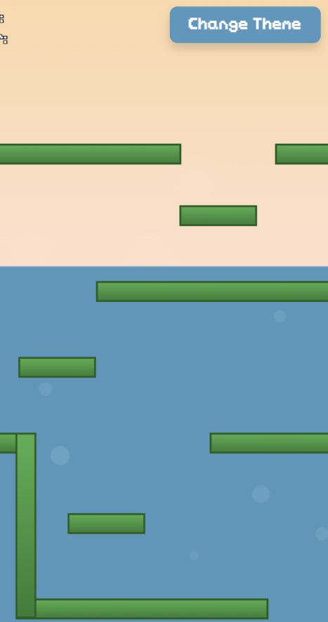

Ook heb ik het canvas een vaste mobiele grootte gegeven en alles in een wrapper geplaatst, zodat het spel zowel op mobiel als desktop goed werkt. Op desktop wordt het canvas netjes gecentreerd weergegeven met een grijze achtergrond eromheen. Daarnaast heb ik code toegevoegd over deltatime wat er voor zorgt dat het canvas op verschillende toestellen op dezelfde framerate wordt laten zien.

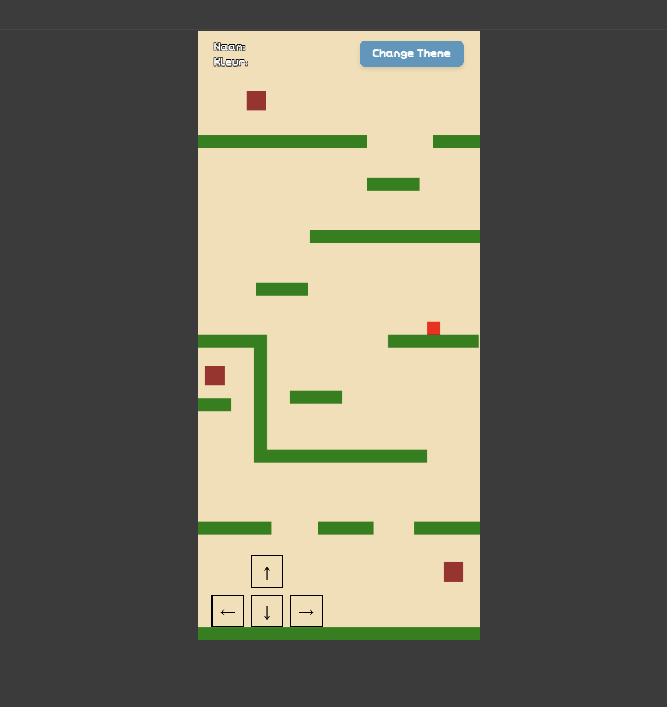

Dinsdag was ik de hele dag bezig met het implementeren van API’s. Via een apart main.js bestand haal ik studentgegevens op uit de database. Ik heb een startscherm toegevoegd waarbij je eerst je naam moet invoeren. Het script zoekt vervolgens naar een match (op naam of nickname). Wanneer er een match is, wordt de naam en favoriete kleur linksboven weergegeven en krijgt de speler deze kleur. Ook worden mijn leerdoelen dynamisch opgehaald uit mijn eigen API en getoond in de popups.

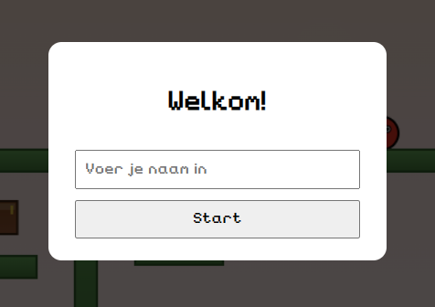 
 

Na de code review heb ik mijn project visueel sterk verbeterd. Alles is volledig met code gemaakt. De speler is nu rond, heeft ogen die meekijken in de looprichting, een rand en een glans. De platforms en achtergrond hebben gradients gekregen en de boeken zien er daadwerkelijk uit als boeken.

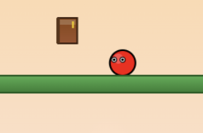 

Tot slot heb ik animaties toegevoegd aan de leerdoel-popups. Elke popup heeft een basisanimatie (fade, scale en rotate) én een uniek effect per leerdoel: confetti bij animaties, een glitch-effect bij code en een vuur-effect bij thema’s bedenken.

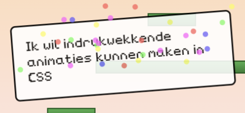 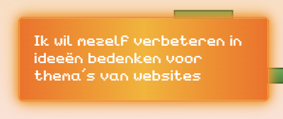 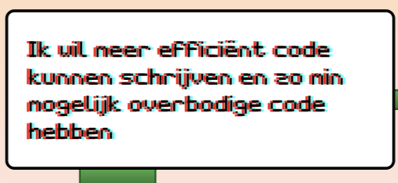 

## Bronnenlijst
Chris Courses Platformer
https://www.youtube.com/watch?v=4q2vvZn5aoo

W3 Schools Positions
https://www.w3schools.com/css/css_positioning.asp

ChatGPT: Lopen met de pijltoetsen
Ik had al code voor het bewegen, maar ik heb aan Chat gevraagd hoe ik handig de functie kan toepassen op zowel WASD, de pijltoetsen en de schermtoetsen voor zowel muis als touch
Prompt:

ChatGPT: Collision met boek
Prompt: 

Animista: CSS Animaties (uitendelijk niet gebruikt)
https://animista.net/play/entrances/rotate-in-2/rotate-in-2-bck-cw